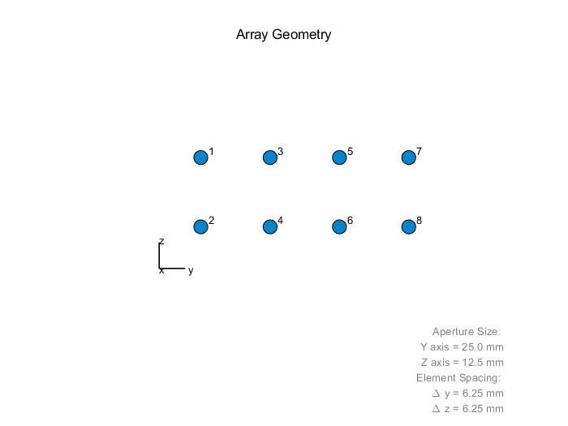
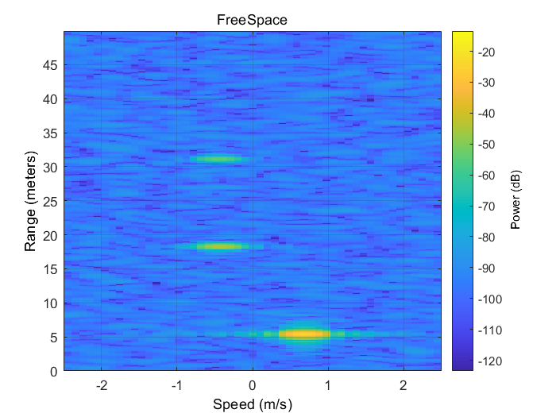
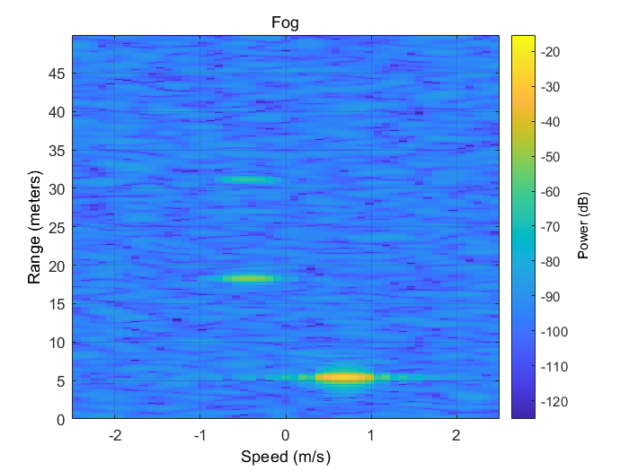

**News**: ...

## Simulation of radar signal in fog environment

Use matlab to simulate radar signal propagation attenuation in fog environment, especially in distance and power.

This works based on **Phased Array System Toolbox**.

### Major images

- **Array Geometry**

  

  
- **FreeSpace propogation**

  

  
- **Fog propogation**

  

## Radar parameters

- Frequency: 24GHz.
- Chirp period: 5e-4s.
- Bandwidth: 500MHz.
- Targets distance: 5.23 18.23 31.20m.
- Targets speed: -0.7 0.47 0.5
- Targets RCS: 0.3 0.3 0.3

## Reference

- [FMCW 2T4R SIM MUSIC](https://github.com/liynjy/FMCW-2T4R-SIM-MUSIC)
- [FMCW 2T4R Multi Target Detection Positioning](https://github.com/liynjy/FMCW_2T4R_Multi_Target_Detection_Positioning)
- [Introduction to mmwave Sensing FMCW Radars](pdf/Introduction-to-mmwave-Sensing-FMCW-Radars.pdf)

## Code Explanations

1. Whether the range_max and v_max settings are within the radar parameter limits.(if so, the sample rate is 2*Bandwidth, nothing to do with range_max or v_max)
2. The ChirpLen*resolution is the max range can be detected.
3. The ChirpNum*resolution is the max speed can be detected.

## License

This project is released under the [Apache 2.0 license](LICENSE).
